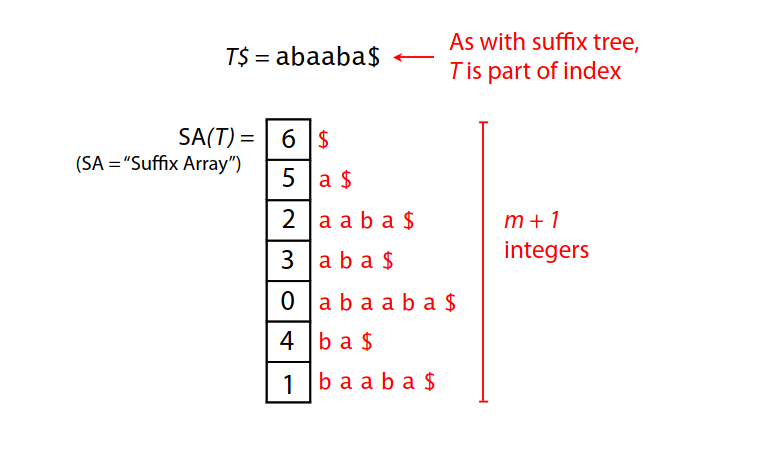

# ZipZop
Zipzop is a **lossless** data compressor for text and images. To prepare the file, it builds the suffix array in O(n) then applies the Burrows-Wheeler Transform followed by the MTF. Furthermore, it uses Huffman coding to encode the data. When applied to the ```input.txt``` file (which is 71 kB), Zipzop achieves a **2.8:1** compression ratio and **64% space saving**, all in **under 14 milliseconds** of compression runtime (the decompression step can get as fast as 4ms). It is inspired by bzip2, which is a legacy lossless compressor found in Unix systems.


Usage
-----
To install Zipzop run:
```install
./install.sh
```
That's it! Now to compress a file called ```input.txt``` run:
```comp
./zipzop input.txt
```
This creates a new file called ```out.compressed``` and it's the compressed version of the given file (clearly). To revert back to the original one run:
```
./unzipzop out.compressed
```
Yay! Your original file is now in out.txt.

Suffix Array construction in O(n) with Skew algorithm:
-----
Step 1) Build suffix array for all i where imod3 != 0. This is done by recursively calling the algorithm for a string of 2/3 the length of the original one.

Step 2) Build suffix array for all i where imod3 = 0. This is done in linear time by creating pairs of type (S[i], rank[i+1]) and then applying radix sort (obs: S[i] is the i-th character of the original string S). The rank array is obtained from the first step, and tells us the relative order of the suffixes. Note that here since imod3=0, the suffix (i+1) lies in the rule defined by the first step, so we already have its suffix and rank arrays. This step is done in O(N).

Step 3) Merge the two suffix arrays from the previous steps, also done in O(N). Essentially, we want to compare a suffix i (where imod3=0) with another suffix j (where jmod3!=0), let's separate it in two cases:
* Case I)  If jmod3=1 : Create pairs of type (S[i], rank[i+1]) and (S[j], rank[j+1]). Note that both suffixes (i+1) and (j+1) lie in the same suffix array (where idx mod3 !=0, created in the first step), so we can compare their ranks directly. Then, we order these pairs in O(N) with radix sort.
* Case II) If jmod3=2 : Create triples of type (S[i], S[i+1], rank(i+2)) and (S[j], S[j+1], rank[j+2]). Note that both suffixes (i+2) and (j+2) lie in the same suffix array (where idx mod3!=0, created in the first step), so we can compare their ranks directly. Then, we order these pairs in O(N) with radix sort.

The final recursion looks like this: T(n) = T(2/3 * n) + O(n), which by the master theorem resolves to O(n) and is clearly **optimal**.



Burrows–Wheeler Transform in O(n)
-----
Given the suffix array for a string S, we can find the BWT of S (and its inverse) easily in O(n). For the BWT, we just traverse the SA and append the character that occurs immediately before the first char in the current suffix (if there isn't one, just append a sentinel character). Basically, BWT[i] = S[SA[i]-1] if SA[i]>0, and BWT[i] = '#' otherwise.

Inverse Burrows–Wheeler Transform in O(n)
-----
The good thing about the BWT is that it's cheaply invertible. Even better, the only information we need to revert back to the original string is the output string of the BWT. Assume that we use a beta-ranking in the suffix array and consider the first char in each suffix, naturally the characters are sorted and the rank only increases (for the same char) as we traverse the array. The LF mapping guarantees that for a given char the *relative order* of the ranking in the first column is also preserved in the last column. Thus, if we pre-compute the rankings of the BWT string in O(n) we can re-construct the original string greedly from right to left. Starting at 0 (cause we know that the sentinel char is the first suffix in the SA) we can infer that the char C that comes immediatly before the sentinel in the og string is at position 0 in the BWT string, so we append it to our answer (remember that the SA can be interpreted as ordering rotations of a string). Even better, we also know this new char's position in the SA, for that we just need to skip the sentinel char (first one) and all types of chars in the alphabet that come before C, then add the offset of the rank[C] (which we pre-calculated for all chars). So the next position we look at is next_pos = 1+n_prev_chars[C]+rank[C]. To find the next char in the og string, we look again at position 'next_pos' in the BWT string. Then, just repeat the process until you hit the sentinel char again and you end up reversing to your original string in O(n). 

Huffman coding in O(nlogn)
-----       
Up to this point, we haven't done any compression yet. The BWT and MTF are just transforming the data around to make it more suitable for encoding later. This is the later! Now that our data is arranged in such a way that similar groups of characters stay together, we apply the Huffman coding to compress the data. It's a legacy **variable length prefix code** that takes advantage of the fact that characters that have a high frequency of occurance in the data should have shorter encodings. Obviously, by the **pigeonhole principle** no lossless compression algorithm can make every data code shorter, some have to get longer (there's no way around that), buttttt... if we make the chars with low frequency have a longer code, we end up with a shorter total encoding overall (hopefully). Note that we also need to store the actual Huffman tree as overhead (so we can decompress the file later), but usually that's not a problem and storing the tree+encodings is better than storing the current file as it is.


Results
-----
The ```input.txt``` file is a well-thought and curated text file designed to test compression (jk, it's actually just the entire movie script of Shrek). For actual testing we generated txt files of sizes 1e2, 1e3, 1e4, 1e5 and filled them with random sentences (check ```make_input.py``` for how), then we analysed the compression ratio and space saving as the size increases. Figures below.


Note: ```test_1e6.txt``` is a text file with about 1 million words obtained by the concatenation of 10x ```test_1e5.txt```(which is a list of 100 thousand random sentences). By the nature of its construction, it's a large txt file with a lot of repetitions - perfect for compression. That's why Zipzop compresses it with a 6.7:1 ratio and **85% space saving**. This shows the power of compression when applied to a big file with a lot of reoccurrences.

Nice TODO:
-----
* Suffix Array construction with Induced Sorting (SA-IS) *might* be faster in practice

Refs:
-----
* https://www.cs.jhu.edu/~langmea/resources/lecture_notes/09_suffix_arrays_v2.pdf (picture of sa, ben langmea lectures)
* http://didawiki.cli.di.unipi.it/lib/exe/fetch.php/magistraleinformaticanetworking/ae/ae2010/notesa.pdf
* https://github.com/Tascate/Suffix-Arrays-in-CPP/blob/master/Skew.cpp (Skew O(n))
* https://en.wikipedia.org/wiki/Huffman_coding

    
